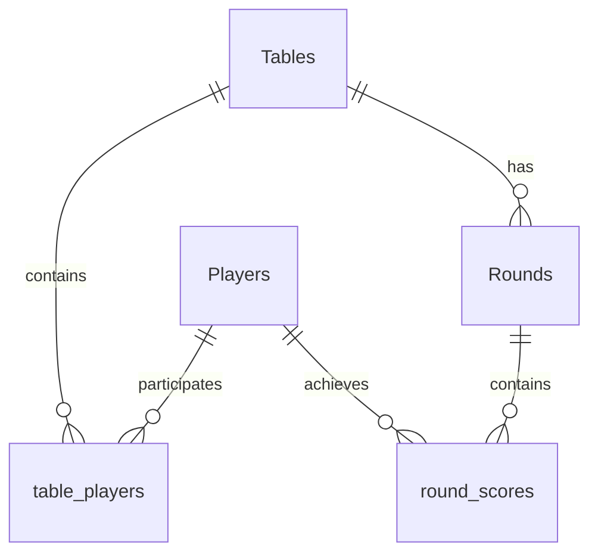

# Schafkopf Tracker Database Structure

The database is built on Supabase (PostgreSQL) and follows a relational structure designed to track game sessions (Tables), the players participating in them, and the scoring for each individual round.

## Tables Overview

### 1. [Players](file:///Users/henribreuer/Programmieren/React/Schafkopf%20Tracker/src/pages/Home.tsx#75-91)
Stores the central registry of all players.
- **`id`**: Unique identifier for the player.
- **`name`**: The display name of the player.
- **`created_at`**: When the player was first added to the system.

### 2. [Tables](file:///Users/henribreuer/Programmieren/React/Schafkopf%20Tracker/src/pages/Home.tsx#58-74)
Represents a gaming session (a "Schafkopf-Tisch").
- **`id`**: Unique identifier for the session.
- **`name`**: A descriptive name for the session (e.g., "Friday Night Cards").
- **`is_open`**: Boolean flag indicating if the game is still active and accepting new rounds/scores.
- **`exclude_from_overall`**: Boolean flag to determine if this session's scores should be excluded from global leaderboards/statistics.
- **`created_at`**: Timestamp of when the session started.

### 3. `table_players` (Junction Table)
Manages the many-to-many relationship between [Tables](file:///Users/henribreuer/Programmieren/React/Schafkopf%20Tracker/src/pages/Home.tsx#58-74) and [Players](file:///Users/henribreuer/Programmieren/React/Schafkopf%20Tracker/src/pages/Home.tsx#75-91).
- **`table_id`**: Reference to the game session.
- **`player_id`**: Reference to a participating player.
- **Purpose**: This table allows a single player to participate in many games, and a single game to have multiple players (typically 4 in Schafkopf, but the system appears flexible).

### 4. `Rounds`
Tracks individual hands or rounds played within a specific table session.
- **`id`**: Unique identifier for the round.
- **`table_id`**: Reference to the parent session in the [Tables](file:///Users/henribreuer/Programmieren/React/Schafkopf%20Tracker/src/pages/Home.tsx#58-74) table.
- **`round_number`**: The sequential number of the round (1, 2, 3...).
- **`created_at`**: Timestamp of when the round was recorded.

### 5. `round_scores`
Stores the actual score achieved by each player in a specific round.
- **`round_id`**: Reference to the round.
- **`player_id`**: Reference to the player whose score is being recorded.
- **`raw_score`**: The numerical score for that hand (positive or negative).
- **Purpose**: By decoupling scores from the round itself, the system can support any number of players per round. In Schafkopf, the app validates that the sum of scores in a round equals zero.

## Entity Relationship Diagram (Conceptual)

