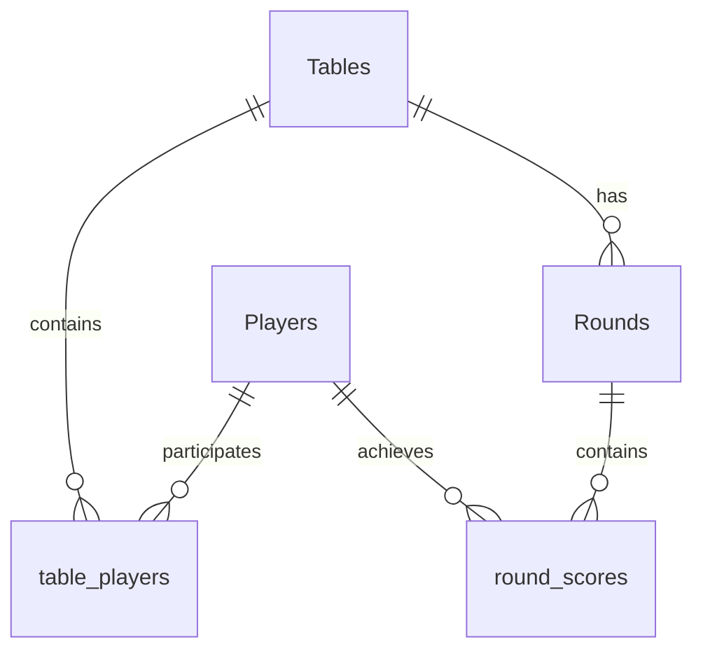

# Schafkopf Tracker Database Structure

The database is built on Supabase (PostgreSQL) and follows a relational structure designed to track game sessions (Tables), the players participating in them, and the scoring for each individual round.

## Tables Overview

### 1. [Players](file:///Users/henribreuer/Programmieren/React/Schafkopf%20Tracker/src/pages/Home.tsx#75-91)

Stores the central registry of all players.

- **`id`**: Unique identifier for the player.
- **`name`**: The display name of the player.
- **`created_at`**: When the player was first added to the system.

### 2. [Tables](file:///Users/henribreuer/Programmieren/React/Schafkopf%20Tracker/src/pages/Home.tsx#58-74)

Represents a gaming session (a "Schafkopf-Tisch").

- **`id`**: Unique identifier for the session.
- **`name`**: A descriptive name for the session (e.g., "Friday Night Cards").
- **`is_open`**: Boolean flag indicating if the game is still active and accepting new rounds/scores.
- **`exclude_from_overall`**: Boolean flag to determine if this session's scores should be excluded from global leaderboards/statistics.
- **`created_at`**: Timestamp of when the session started.
- **`scoring_config`**: The tariff this game is scored with (jsonb). Copied from `schafkopf_settings` when the game is created, so later changes to the default never rescore an existing game. Parsed by `parseScoringConfig` in `src/features/schafkopf/domain/gameModes.ts`.

### 3. `table_players` (Junction Table)

Manages the many-to-many relationship between [Tables](file:///Users/henribreuer/Programmieren/React/Schafkopf%20Tracker/src/pages/Home.tsx#58-74) and [Players](file:///Users/henribreuer/Programmieren/React/Schafkopf%20Tracker/src/pages/Home.tsx#75-91).

- **`table_id`**: Reference to the game session.
- **`player_id`**: Reference to a participating player.
- **Purpose**: This table allows a single player to participate in many games, and a single game to have multiple players (typically 4 in Schafkopf, but the system appears flexible).

### 4. `Rounds`

Tracks individual hands or rounds played within a specific table session.

- **`id`**: Unique identifier for the round.
- **`table_id`**: Reference to the parent session in the [Tables](file:///Users/henribreuer/Programmieren/React/Schafkopf%20Tracker/src/pages/Home.tsx#58-74) table.
- **`round_number`**: The sequential number of the round (1, 2, 3...). Allocated by the database (`save_round`), never by the client.
- **`created_at`**: Timestamp of when the round was recorded.
- **`game_mode`** (`schafkopf_game_mode`): What was played — `sauspiel`, `hochzeit`, `farbsolo`, `wenz`, `geier`, `farbwenz`, `farbgeier`, `bettel`, `ramsch`, or `manual` for free entry. **Null for every round recorded before game modes existed.**
- **`suit`** (`schafkopf_suit`): The suit of a Farbsolo/Farbwenz/Farbgeier, or the called Sau in a Sauspiel (optional).
- **`declarer_won`**: Whether the declarer's side won. In Ramsch the declarer is the selected player, so this is `false` for the loser and `true` for a Durchmarsch.
- **Extras**: `schneider`, `schwarz`, `laufende`, `klopfer`, `kontra`, `re`, `tout`, `sie`, `jungfrau`, `durchmarsch`.

### 5. `round_scores`

Stores the actual score achieved by each player in a specific round.

- **`round_id`**: Reference to the round.
- **`player_id`**: Reference to the player whose score is being recorded.
- **`raw_score`**: The numerical score for that hand (positive or negative). Still the source of truth for points: for mode-based rounds it is derived from the game's tariff when the round is saved.
- **`role`** (`round_role`): `declarer`, `partner`, `opponent` or `sitting_out`. Null for manual and legacy rounds.
- **Purpose**: By decoupling scores from the round itself, the system can support any number of players per round. In Schafkopf, the app validates that the sum of scores in a round equals zero.

### 6. `schafkopf_settings`

A single row holding the global default tariff (`scoring_config`) that new games copy. Editable by everyone.

## Functions

- **`save_round(p_table_id, p_round, p_scores, p_round_id?)`**: Inserts the next round (or updates `p_round_id`) with its facts and every player's score and role in one transaction. Rejects scores that don't sum to zero.
- **`set_table_scoring_config(p_table_id, p_config, p_rounds)`**: Changes a game's tariff and rewrites the recalculated scores of the given rounds atomically.
- **`add_round(p_table_id)`**: The previous way to add an empty round. Kept until no deployed client uses it.

## Example queries

```sql
-- Solos played and won, per player
select p.name, count(*) as solos, count(*) filter (where r.declarer_won) as won
from "Rounds" r
join round_scores rs on rs.round_id = r.id and rs.role = 'declarer'
join "Players" p on p.id = rs.player_id
where r.game_mode = 'farbsolo'
group by p.name;
```

## Statistics and legacy rounds

The Stats page (`/stats`, `src/features/schafkopf/domain/statistics/`) reads rounds with and without a `game_mode`. Rounds without one (and `manual` rounds) are classified by their score pattern: two up / two down is a team game, one up / three down a won solo, one down / three up a lost solo **or** a Ramsch loser (the amounts overlap, so these stay ambiguous). All-zero rounds are ignored. Mode-only figures (win rate per mode, Kontra/Re, Ramsch) use only rounds with a recorded mode.

## Entity Relationship Diagram (Conceptual)


```mermaid
erDiagram
    Players ||--o{ table_players : participates
    Tables ||--o{ table_players : contains
    Tables ||--o{ Rounds : has
    Rounds ||--o{ round_scores : contains
    Players ||--o{ round_scores : achieves
```
